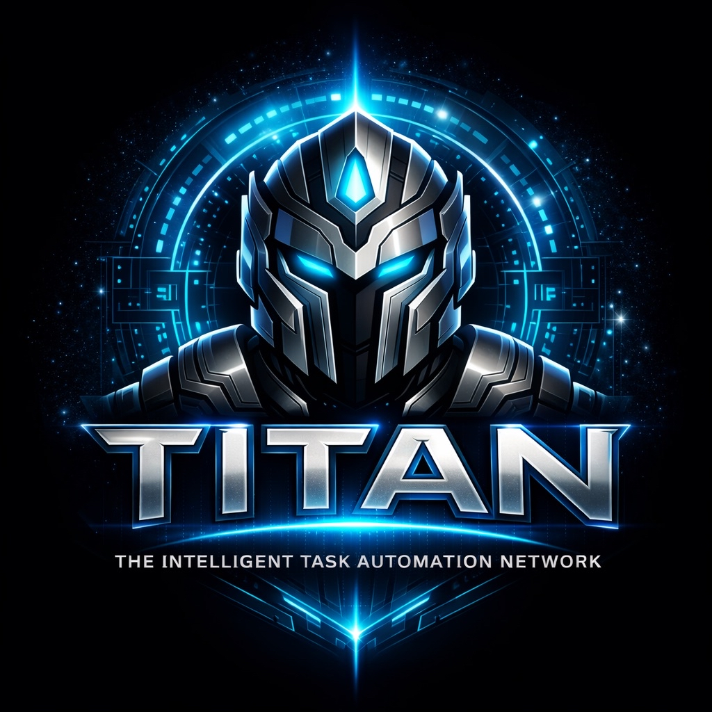

<p align="center">
  
</p>

<h1 align="center">🤖 TITAN</h1>
<p align="center"><strong>The Intelligent Task Automation Network</strong></p>

> **Secure. Proactive. Revolutionary.**  
> The AI agent platform that thinks, learns, and improves itself.  
> Built in Rust. Designed for safety. Ready for autonomy.

[](https://www.rust-lang.org/)
[](https://opensource.org/licenses/MIT)
[]()
[]()

[Website](https://titan.sh) · [Docs](https://docs.titan.sh) · [Getting Started](#getting-started) · [Security](#security) · [Discord](https://discord.gg/titan)

---

## 🚀 What is TITAN?

TITAN is a **next-generation AI agent platform** you run on your own hardware. Unlike other assistants that wait for commands, TITAN **observes, reasons, plans, and acts** through a continuous cognitive loop — all while learning from its own mistakes.

It answers you on **Discord** (Telegram, Slack, Signal coming soon), runs as a **daemon service**, and hosts a **local web dashboard** you control. It can spawn **sub-agents** for parallel tasks, trade knowledge with other agents, and switch between **reasoning personas** based on the task at hand.

If you want an autonomous, security-first assistant that feels **local, private, and continuously improving**, this is it.

### ⚡ The TITAN Difference

While other agents give skills full system access, TITAN **sandboxes everything in WASM**. While others make security optional, TITAN **mandates approvals** for sensitive operations. While others stay static, TITAN **learns and improves itself**.

**This isn't just another agent. This is what comes after.**

---

## 🎯 Quick Start (60 Seconds)

**Preferred setup:** Run the onboarding wizard:

```bash
# One-line install (Linux/macOS/WSL2)
curl -fsSL https://titan.sh/install.sh | bash

# Start the wizard
titan onboard
```

The wizard guides you through:
- Setting up the workspace
- Configuring autonomy mode (supervised/collaborative/autonomous)
- Connecting Discord (optional)
- Creating your first goal
- Running a test task

### Alternative: Manual Install

```bash
# Clone
git clone https://github.com/yourusername/titan.git
cd titan

# Build
cargo build --release

# Configure
./scripts/configure.sh

# Run
./target/release/titan
```

**Prerequisites:**
- Rust 1.75+ ([rustup.rs](https://rustup.rs))
- SQLite 3.x (usually pre-installed)
- Linux, macOS, or Windows (WSL2)

---

## 🧠 Core Concepts

### The Cognitive Loop

TITAN doesn't just respond — it **thinks continuously**:

```
PERCEIVE → REASON → PLAN → ACT → OBSERVE → REFLECT → LEARN
   ↑                                                  ↓
   └──────────────────────────────────────────────────┘
```

### Multi-Agent Orchestration

Like Claude Code's 16-agent compiler breakthrough, TITAN spawns **sub-agents** for parallel tasks:

- **Task Decomposition:** Break complex goals into subtasks
- **Parallel Execution:** Multiple agents work simultaneously
- **Result Aggregation:** Combine outputs intelligently
- **Agent Communication:** Built-in protocol for coordination

### Self-Improvement Loop

TITAN captures its own failures and learns:

- **Error Pattern Recognition:** Identifies recurring mistakes
- **Strategy Updates:** Refines procedural memory automatically
- **Performance Optimization:** Gets faster with use
- **Knowledge Accumulation:** Builds expertise over time

### Reasoning Personas

Switch thinking modes based on the task:

| Persona | Use For |
|---------|---------|
| **Engineer** | Methodical, careful implementation |
| **Devil's Advocate** | Challenge assumptions, find edge cases |
| **Gonzo** | Creative, out-of-the-box solutions |
| **Precedent** | Conservative, proven approaches |

---

## 🛡️ Security-First Architecture

### Why TITAN is Safer

| Feature | TITAN | OpenClaw | AutoGPT | CrewAI |
|---------|-------|----------|---------|--------|
| **Skill Sandboxing** | ✅ WASM + WASI | ❌ None | ❌ None | ❌ None |
| **Mandatory Approvals** | ✅ Required | ⚠️ Optional | ⚠️ Optional | ⚠️ Optional |
| **Secret Isolation** | ✅ Environment | ❌ In code | ❌ In code | ⚠️ Variable |
| **Immutable Audit** | ✅ SQLite + checksum | ⚠️ Optional | ❌ None | ❌ None |
| **Resource Limits** | ✅ Built-in | ❌ None | ❌ None | ❌ None |
| **Emergency Kill** | ✅ `!emergency` | ❌ None | ❌ None | ❌ None |

### Threat Model Mitigations

| Threat | How TITAN Blocks It |
|--------|---------------------|
| **Malicious Skills** | WASM sandbox with capability-based permissions |
| **Prompt Injection** | Input sanitization + mandatory approval gates |
| **Workspace Escape** | Strict path canonicalization + bounds checking |
| **Secret Exfiltration** | Secrets isolated in env, never accessible to skills |
| **Command Injection** | Allowlist-based command execution only |
| **Resource Exhaustion** | Memory caps, timeouts, circuit breakers |

### Permission Classes

| Class | Operations | Collaborative Mode | Supervised Mode |
|-------|------------|-------------------|-----------------|
| **READ** | `list_dir`, `read_file`, `search` | Auto-approved | Requires approval |
| **WRITE** | `write_file`, `git_commit` | 🔒 Requires approval | 🔒 Requires approval |
| **EXEC** | `run_command`, `execute` | 🔒 Requires approval | 🔒 Requires approval |
| **NET** | `http_get`, `api_call` | 🔒 Requires approval | 🔒 Requires approval |

**In collaborative mode (default):** Safe operations happen automatically. Risky operations pause for your approval via Discord or web UI.

---

## 💾 Four-Tier Memory System

All data stays **local, encrypted, and private**:

| Tier | Purpose | Persistence |
|------|---------|-------------|
| **Working** | Short-term context, current session | In-memory |
| **Episodic** | Execution traces, decision history | SQLite (immutable) |
| **Semantic** | Facts, concepts, knowledge | SQLite + vector search |
| **Procedural** | Learned strategies, patterns | SQLite (self-updating) |

---

## 🎮 Usage

### Start TITAN

```bash
# Default mode (collaborative)
titan

# Supervised mode (safest for beginners)
titan --supervised

# Autonomous mode (with emergency killswitch)
titan --autonomous

# Headless mode (no Discord, no web)
titan --headless
```

### Discord Commands

```
!status                 Show system status and current mode
!mode <mode>            Change autonomy mode
!goal <description>     Submit a new goal to TITAN
!approve <request_id>   Approve a pending action
!deny <request_id>      Deny a pending action
!memory <query>         Query episodic memory
!emergency              STOP ALL OPERATIONS IMMEDIATELY
!persona <name>         Switch reasoning mode
!agents                 List active sub-agents
```

### Web Dashboard

Access at `http://127.0.0.1:3000`:

- Real-time system status
- Active goals and sub-agents
- Pending approvals queue
- Memory browser and search
- Execution trace visualization
- Resource monitoring

---

## 🧪 Example Tasks

### 1. Multi-Agent Code Review
```
!goal Review the codebase for security issues using 3 specialist agents:
- One for dependency vulnerabilities
- One for input validation gaps  
- One for secret exposure risks
Aggregate findings and propose fixes.
```

TITAN spawns 3 sub-agents, each with a specialty persona, runs them in parallel, and presents a unified report.

### 2. Self-Improving Documentation
```
!goal Check if README is outdated by comparing to recent code changes.
If outdated, propose updates and wait for approval.
```

TITAN learns from your acceptance/rejection of its proposals and improves its documentation generation over time.

### 3. Autonomous System Maintenance
```
!goal Every day at 9 AM: check disk space, git status, and security logs.
Alert me on Discord if anything needs attention.
```

TITAN schedules the task, executes autonomously (within permission bounds), and learns which alerts you actually care about.

---

## 📚 Documentation

- **[Getting Started](docs/GETTING_STARTED.md)** — Your first 10 minutes with TITAN
- **[Installation](docs/INSTALL.md)** — Detailed installation guide
- **[Onboarding](docs/ONBOARDING.md)** — First-run wizard walkthrough
- **[Security Architecture](docs/SECURITY_AUDIT.md)** — Complete security analysis (A+ rating)
- **[Architecture Overview](docs/architecture.md)** — System design and cognitive loop
- **[API Reference](docs/API.md)** — Discord and web API documentation
- **[Contributing](CONTRIBUTING.md)** — How to contribute to TITAN
- **[Roadmap](ROADMAP.md)** — Future development plans

---

## 🤝 TITAN vs The Competition

### What We Kept From OpenClaw
- ✅ Multi-channel support architecture
- ✅ Skill/plugin extensibility
- ✅ Flexible model integration
- ✅ Active gateway/daemon process
- ✅ Easy onboarding wizard

### What We Fixed
- ❌ **Skills run unsandboxed** → ✅ WASM sandboxing with WASI
- ❌ **Optional security** → ✅ Mandatory approvals
- ❌ **Weak workspace isolation** → ✅ Strict path validation
- ❌ **Secrets in code/logs** → ✅ Environment isolation only
- ❌ **No audit trail** → ✅ Immutable execution traces

### What Nobody Else Has
- 🚀 **Multi-agent teams** — Spawn sub-agents for parallel work
- 🚀 **Self-improvement** — Captures failures, updates strategies
- 🚀 **Reasoning personas** — Devil's Advocate, Gonzo, Precedent modes
- 🚀 **Knowledge marketplace** — Agents trade expertise
- 🚀 **Native MCP** — Industry-standard protocol support
- 🚀 **Emergency killswitch** — Immediate stop capability

---

## 🧪 Testing

```bash
# Run all tests
cargo test

# Security-specific tests
cargo test --test security

# Integration tests
cargo test --test integration

# Run security check
./scripts/security-check.sh

# With logging
RUST_LOG=titan=debug cargo test
```

---

## 🛠️ Development

```bash
# Clone your fork
git clone https://github.com/YOUR_USERNAME/titan.git
cd titan

# Build debug version
cargo build

# Build release (optimized)
cargo build --release

# Run with info logging
RUST_LOG=titan=info cargo run

# Run the security check
./scripts/security-check.sh
```

See [CONTRIBUTING.md](CONTRIBUTING.md) for contribution guidelines.

---

## 📜 License

MIT License — Copyright (c) 2026 Michael Anthony Carleton Elliott

See [LICENSE: MIT License](LICENSE:%20MIT%20License) for full text.

---

## 🙏 Credits

- **OpenClaw** — For the inspiration and proving the model
- **Rust Community** — For memory safety without garbage collection
- **Claude Code** — For demonstrating multi-agent potential
- **Serenity** — Discord library for Rust
- **Axum** — Web framework
- **Wasmtime** — WebAssembly runtime
- **SQLx** — Async SQLite

---

## 🔮 Roadmap

### Phase 1: Foundation (Now)
- [x] Core architecture with cognitive loop
- [x] WASM sandboxing for skills
- [x] Multi-agent orchestration
- [x] Self-improvement system
- [x] Reasoning personas
- [x] MCP protocol support
- [x] Security-first design (A+ audit)

### Phase 2: Expansion (Q2 2026)
- [ ] Telegram, Slack, Signal support
- [ ] GitHub integration
- [ ] IDE plugins (VS Code, IntelliJ)
- [ ] Browser automation polish
- [ ] Plugin marketplace

### Phase 3: Enterprise (Q3 2026)
- [ ] Team collaboration
- [ ] SSO integration
- [ ] Audit dashboards
- [ ] Policy enforcement
- [ ] Distributed agent teams

### Phase 4: The Future (2027+)
- [ ] Voice interface
- [ ] Mobile companion
- [ ] Agent-to-agent negotiation protocol
- [ ] Hardware integration

---

## 💬 Community

- **Discord:** [discord.gg/titan](https://discord.gg/titan)
- **GitHub Discussions:** [github.com/titan/titan/discussions](https://github.com/titan/titan/discussions)
- **Twitter/X:** [@titan_agent](https://twitter.com/titan_agent)
- **Email:** hello@titan.sh

---

## ⭐ Star History

[](https://star-history.com/#titan/titan&Date)

---

**🦀 Built with Rust for safety.  
🧠 Designed for autonomy.  
🔒 Secure by default.  
🚀 Ready for the future.**

*The agent platform that improves itself.*
